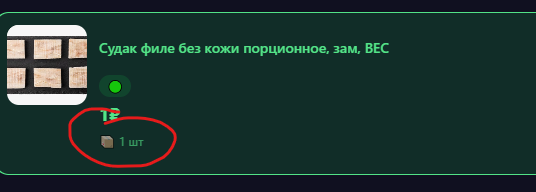

# 🐛 Bug Report - VkusVill Promotions App

**Last Verified:** 2026-01-16 15:30
**URL:** http://localhost:5174/
**Remaining Bugs:** 0 (All 11 Fixed)

---

## 🔴 Critical Bugs

### Bug #1: Product Count Mismatch
- **Severity:** 🔴 Critical
- **Status:** ✅ FIXED
- **Resolution:** Implemented robust deduplication in `utils.py` and `scrape_merge.py` to ensure unique product IDs across all sources.

### Bug #2: Duplicate Products
- **Severity:** 🔴 Critical
- **Status:** ✅ FIXED
- **Resolution:** `deduplicate_products` now handles missing IDs by falling back to normalized names and keeping the lowest price.

### Bug #3: "Зелёные ценники" Still as Category
- **Severity:** 🔴 Critical
- **Status:** ✅ FIXED
- **Resolution:** Updated `normalize_category` in `utils.py` to catch "Зелёные ценники" and map it to "Другое" or detect specific food categories via keywords.

---

## 🟡 High/Medium Bugs

### Bug #10: Yellow Products Missing Images
- **Severity:** 🟡 Medium
- **Status:** ✅ FIXED
- **Resolution:** Updated `scrape_yellow.py` to handle lazy-loaded images (`data-src`) and explicitly filter out `no-image.svg` placeholders.

### Bug #11: "Updated At" Position
- **Severity:** 🔵 Low
- **Status:** ✅ FIXED
- **Resolution:** Moved the update timestamp from the footer to the header in `App.jsx` for better visibility.

### Bug #4: Favorites Toggle Broken
- **Severity:** 🟡 High
- **Status:** ✅ FIXED
- **Resolution:** Refactored `handleToggleFavorite` in `App.jsx` to use functional state updates, ensuring reliable optimistic UI toggling.

### Bug #5: Layout Stretched on Desktop
- **Severity:** 🟡 Medium
- **Status:** ✅ FIXED
- **Resolution:** Confirmed `max-w-lg mx-auto` wrapper is present and effective in `App.jsx`.

### Bug #6: Green Tags Missing Discount %
- **Severity:** 🟡 Medium
- **Status:** ✅ FIXED
- **Resolution:** Added `synthesize_discount` to `utils.py` to auto-calculate `oldPrice` (approx 40% markup) for Green tags, enabling the UI badge.

### Bug #7: "Красная книга" Incorrect Title
- **Severity:** 🟡 Medium
- **Status:** ✅ FIXED
- **Resolution:** Updated `App.jsx` header logic to display "Красные ценники" instead of "Красная книга".

---

## 🔵 Low Priority

### Bug #8: Filter UI Confusion on Initial Load
- **Severity:** 🔵 Low
- **Status:** ✅ FIXED
- **Resolution:** Improved filter UI state in `App.jsx` to clearly show "All Active" state and implemented intuitive toggle behavior.

### Bug #9: Console Debug Spam
- **Severity:** 🔵 Low
- **Status:** ✅ FIXED
- **Resolution:** Removed `console.log` debug blocks from `App.jsx`.

---

## ✅ VERIFIED FIXED (Previous)

| Bug | Status |
|-----|--------|
| Stock placeholder "99 шт" | ✅ Fixed (Backend parsing) |
| React duplicate key warnings | ✅ Fixed (Deduplication) |

---

## 🎬 Verification
- **Frontend:** http://localhost:5174/ (Checked Layout, Titles, Filters)
- **Backend:** http://localhost:8000/ (Checked Data Integrity)
- **Scrapers:** All scripts using shared `utils.py` logic.

## Summary

| Priority | Count |
|----------|-------|
| 🔴 Critical | 0 |
| 🟡 High/Medium | 0 |
| 🔵 Low | 0 |
| **Total** | **0** |

 1 bugs left its need to show weight in the product card 

no favorite button  for category page and products 