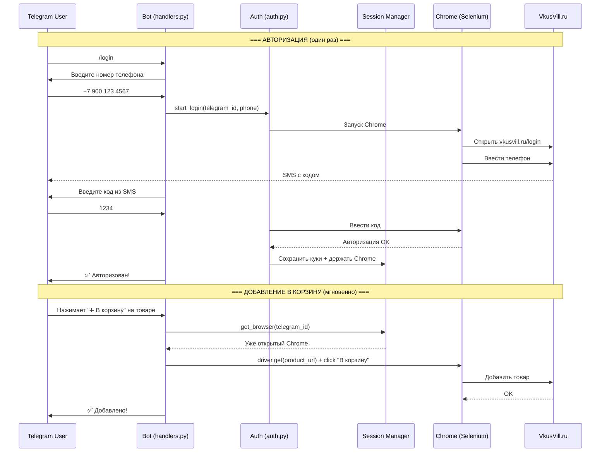

# Добавление товаров в корзину VkusVill через Telegram-бот

## Цель

Позволить пользователям Telegram-бота добавлять товары напрямую в свою корзину VkusVill. Каждый пользователь авторизуется через свой номер телефона, бот держит для него открытый браузер.

## Архитектура



## Ключевые решения

| Решение | Выбор | Почему |
|---------|-------|--------|
| Куда добавлять | Реальная корзина VkusVill | Пользователь потом оформляет заказ на сайте |
| Как добавлять | Selenium/Chrome | Нет публичного API у VkusVill |
| Авторизация | Телефон + SMS-код через бота | Простой UX для пользователя |
| Хранение кук | Файлы `data/user_cookies/{tg_id}.json` | Уже используется такой паттерн |
| Сессия браузера | **Persistent** — Chrome остаётся открытым | ~1 сек на добавление вместо ~20 сек |
| Масштаб | До 5 пользователей | Простая очередь, без воркеров |
| UI | Кнопка "➕" в карточке товара | Самый удобный UX |

## Структура файлов

```
saleapp/
├── bot/
│   ├── handlers.py          ← + /login команда, + callback "add_to_cart:{product_id}"
│   └── auth.py              ← NEW: авторизация пользователей VkusVill
├── cart/
│   ├── __init__.py
│   ├── session_manager.py   ← NEW: управление persistent Chrome-сессиями
│   └── add_to_cart.py       ← NEW: логика добавления товара в корзину
├── data/
│   ├── cookies.json         ← общие куки для скраперов (без изменений)
│   └── user_cookies/        ← NEW: куки каждого юзера
│       ├── 123456789.json
│       └── 987654321.json
```

## Компоненты

---

### 1. `bot/auth.py` — Авторизация пользователя

**Flow:**
1. Пользователь пишет `/login`
2. Бот запрашивает номер телефона (кнопка "Отправить номер")
3. Бот запускает Chrome, открывает VkusVill, вводит телефон
4. VkusVill шлёт SMS → бот просит ввести код
5. Бот вводит код в Chrome → авторизация → куки сохраняются в `data/user_cookies/{tg_id}.json`
6. Chrome остаётся ОТКРЫТЫМ (persistent session)

**Ключевое:** состояние "ожидаю код" хранится в `ConversationHandler` (telegram.ext).

---

### 2. `cart/session_manager.py` — Управление Chrome-сессиями

```python
class SessionManager:
    """Держит открытые Chrome-сессии для авторизованных пользователей."""
    
    _sessions: dict[int, uc.Chrome]  # telegram_id → driver
    
    def get_or_create(self, telegram_id: int) -> uc.Chrome
    def close(self, telegram_id: int)
    def close_all(self)
    def is_alive(self, telegram_id: int) -> bool
    def has_saved_cookies(self, telegram_id: int) -> bool
```

> [!IMPORTANT]
> `/login` — **ОДНОРАЗОВАЯ** операция. Куки сохраняются в файл и переиспользуются.

- При `/login` (один раз) — создаёт Chrome, авторизуется, сохраняет куки в файл, держит Chrome открытым
- При "В корзину" — если Chrome открыт → используем его (~1 сек). Если Chrome закрылся (перезагрузка бота и т.д.) → открываем новый и загружаем куки из файла (~10 сек, но без участия юзера)
- Если куки протухли (VkusVill разлогинил) → бот говорит "Сессия истекла, нажмите /login"
- При `post_shutdown` бота — закрывает все Chrome, но куки остаются в файлах

---

### 3. `cart/add_to_cart.py` — Добавление товара

```python
async def add_product_to_cart(driver: uc.Chrome, product_url: str) -> bool:
    """Открывает страницу товара и кликает 'В корзину'."""
    driver.get(product_url)
    # Ждём загрузки, кликаем кнопку
    # Возвращает True если добавлено
```

Быстрая операция (~1-3 сек) т.к. Chrome уже открыт и авторизован.

---

### 4. Изменения в `bot/handlers.py`

- Новая команда `/login` — запускает flow авторизации
- Inline-кнопка `➕ В корзину` на каждом товаре
- Callback `add_to_cart:{product_id}` — обрабатывает нажатие

---

## Про админ-панель

> [!NOTE]
> Пароль админ-панели: `266221` (пользователь указал). Нужно обновить `ADMIN_TOKEN` в `config.py`.

---

## Verification Plan

### Тесты
1. `/login` flow — ручной тест: ввести телефон, получить SMS, ввести код
2. Persistent session — проверить что Chrome не закрывается после логина
3. "В корзину" — нажать кнопку, проверить что товар появился в корзине VkusVill
4. Session recovery — убить Chrome, нажать "В корзину", проверить что сессия пересоздалась из кук

### Порядок реализации
1. `cart/session_manager.py` — фундамент
2. `bot/auth.py` — авторизация
3. `cart/add_to_cart.py` — добавление
4. `bot/handlers.py` — UI кнопки + команды
5. Ручное тестирование полного flow
